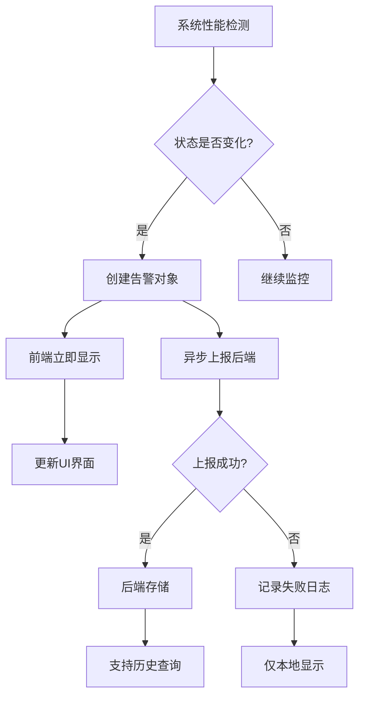

# 系统性能告警设计思路

## 项目背景

银行监控告警系统中的系统性能监控模块，需要实现对CPU、内存、磁盘等系统指标的实时监控和告警功能。

## 核心问题分析

### 问题1：告警泛滥
- **现象**：系统每10秒刷新一次，如果每次都记录告警，一天会产生8640条记录
- **影响**：告警区域被大量重复信息淹没，无法有效识别真正的问题
- **根本原因**：缺乏告警去重和状态管理机制

### 问题2：前端 vs 后端处理
- **当前情况**：系统监控数据通过本地API获取，后端无法直接处理
- **技术限制**：Electron应用的系统监控依赖本地API，后端无法获取客户端系统信息
- **架构考虑**：需要在前端实现告警逻辑，但要符合企业级系统的设计原则

## 解决方案设计

### 1. 告警去重机制

#### 状态变化触发策略
```typescript
// 核心思路：只在状态发生变化时创建告警
const alertStates = ref<Map<string, boolean>>(new Map())

// 检查逻辑
if (isCpuHigh && !wasCpuHigh) {
    // 从正常变为异常 → 创建告警
    createAlert()
} else if (!isCpuHigh && wasCpuHigh) {
    // 从异常恢复正常 → 创建恢复通知
    createRecoveryAlert()
}
```

#### 告警阈值设计
- **CPU告警阈值**：85% (警告) / 95% (严重)
- **内存告警阈值**：80% (警告) / 90% (严重)
- **磁盘告警阈值**：85% (警告) / 95% (严重)

**设计原则**：
1. 阈值设置要合理，避免正常波动触发告警
2. 分级告警，区分警告和严重级别
3. 预留缓冲区间，避免频繁状态切换

### 2. 告警生命周期管理

#### 告警状态流转
```
正常状态 → 异常检测 → 创建告警 → 下一次的系统监测状态 → 创建恢复通知 → 正常状态
```

#### 数据量控制（仅限仪表盘显示）
- **告警数量限制**：最多保留50条最新告警
- **自动清理**：超出限制的旧告警自动移除
- **内存管理**：避免前端内存无限增长

### 3. 前端告警处理的合理性分析

#### 适用场景
✅ **Electron桌面应用**
- 系统监控数据只能在客户端获取
- 前端有完整的JavaScript运行环境
- 可以实现复杂的业务逻辑

✅ **实时性要求**
- 系统性能告警需要实时响应
- 避免网络延迟影响告警及时性
- 减少服务器压力

#### 企业级考虑
⚠️ **数据持久化**
- 前端告警数据易丢失（刷新页面、应用重启）
- 无法进行历史数据分析
- 缺乏审计追踪能力

⚠️ **集中管理**
- 无法实现多客户端告警统一管理
- 难以进行告警统计和分析
- 运维人员无法集中监控

#### 改进方案：混合架构
采用"前端实时检测 + 后端持久化存储"的混合架构模式：

```typescript
// 混合架构实现
const createPerformanceAlert = async (alertData: AlertItem) => {
    // 1. 立即在前端显示告警（保证实时性）
    alerts.value.unshift(alertData)
    updateAlertDisplay()

    // 2. 异步上报到后端存储（不阻塞前端）
    reportAlertToBackend(alertData)
}

const reportAlertToBackend = async (alert: AlertItem) => {
    try {
        await (window.api as any).reportAlert({
            type: alert.type,
            level: alert.level,
            message: alert.message,
            source: alert.source,
            timestamp: alert.timestamp,
            clientId: getClientId(), // 客户端唯一标识
            metrics: alert.metrics
        })
        console.log('✅ 告警已上报到后端')
    } catch (error) {
        console.warn('⚠️ 告警上报失败，仅本地显示:', error)
        // 上报失败不影响本地告警显示
    }
}
```

**混合架构优势**：
- ✅ **实时性**：前端立即显示，无延迟
- ✅ **持久化**：后端存储，支持历史查询
- ✅ **可靠性**：上报失败不影响本地功能
- ✅ **扩展性**：支持多客户端数据汇总

## 技术实现细节

### 1. 混合架构实现流程



### 2. 状态管理
```typescript
interface AlertState {
    cpu: boolean      // CPU是否处于告警状态
    memory: boolean   // 内存是否处于告警状态
    disk: boolean     // 磁盘是否处于告警状态
}

// 使用Map存储各指标的告警状态
const alertStates = ref<Map<string, boolean>>(new Map())

// 客户端标识管理
const getClientId = (): string => {
    // 生成或获取客户端唯一标识
    let clientId = localStorage.getItem('client-id')
    if (!clientId) {
        clientId = `client-${Date.now()}-${Math.random().toString(36).substr(2, 9)}`
        localStorage.setItem('client-id', clientId)
    }
    return clientId
}
```

### 3. 告警对象结构
```typescript
interface PerformanceAlert {
    id: string                    // 唯一标识
    type: 'performance'           // 告警类型
    level: 'high' | 'medium' | 'low'  // 告警级别
    message: string               // 告警信息
    source: '系统监控'            // 告警来源
    timestamp: Date               // 创建时间
    clientId?: string             // 客户端标识（用于后端存储）
    metrics?: {                   // 性能指标（可选）
        cpu?: number
        memory?: number
        disk?: number
    }
    reported?: boolean            // 是否已上报到后端
    reportError?: string          // 上报失败的错误信息
}
```

### 4. 后端接口设计
```typescript
// 告警上报接口
interface ReportAlertRequest {
    type: 'performance' | 'business' | 'system'
    level: 'high' | 'medium' | 'low'
    message: string
    source: string
    timestamp: string
    clientId: string
    metrics?: Record<string, number>
}

// 后端响应
interface ReportAlertResponse {
    success: boolean
    alertId?: string
    message?: string
}
```

### 5. 检测频率优化
```typescript
// 避免过于频繁的检测
const PERFORMANCE_CHECK_INTERVAL = 10000  // 10秒检测一次
const ALERT_COOLDOWN = 60000              // 同类告警1分钟冷却期
const REPORT_RETRY_INTERVAL = 30000       // 上报失败重试间隔
const MAX_RETRY_ATTEMPTS = 3              // 最大重试次数
```

### 6. 错误处理和重试机制
```typescript
const reportWithRetry = async (alert: AlertItem, retryCount = 0): Promise<void> => {
    try {
        await reportAlertToBackend(alert)
        alert.reported = true
    } catch (error) {
        alert.reportError = error.message

        if (retryCount < MAX_RETRY_ATTEMPTS) {
            console.log(`告警上报失败，${REPORT_RETRY_INTERVAL/1000}秒后重试 (${retryCount + 1}/${MAX_RETRY_ATTEMPTS})`)
            setTimeout(() => {
                reportWithRetry(alert, retryCount + 1)
            }, REPORT_RETRY_INTERVAL)
        } else {
            console.error('告警上报最终失败，已达到最大重试次数')
        }
    }
}
```

## 最佳实践建议

### 1. 告警阈值调优
- **初始阈值**：基于系统正常运行时的基线设定
- **动态调整**：根据实际运行情况调整阈值
- **环境差异**：开发、测试、生产环境使用不同阈值

### 2. 用户体验优化
- **视觉区分**：不同级别告警使用不同颜色和图标
- **信息完整**：告警信息包含具体数值和建议操作
- **恢复通知**：问题解决后及时通知用户

### 3. 性能考虑
- **内存控制**：限制告警数量，避免内存泄漏
- **计算优化**：避免复杂计算影响UI响应
- **异步处理**：告警检测和UI更新异步进行

## 扩展方向

### 1. 告警规则配置化
```typescript
interface AlertRule {
    metric: 'cpu' | 'memory' | 'disk'
    warningThreshold: number
    criticalThreshold: number
    enabled: boolean
}
```

### 2. 告警聚合
- 相同类型告警合并显示
- 批量操作支持
- 告警统计信息

### 3. 通知机制
- 桌面通知
- 邮件通知（需要后端支持）
- 声音提醒

## 总结

当前的前端告警处理方案在Electron应用场景下是合理的，主要优势：
1. **实时性好**：无网络延迟，响应迅速
2. **技术可行**：充分利用客户端能力
3. **用户体验佳**：即时反馈，交互流畅

主要限制：
1. **数据持久化**：重启应用后告警历史丢失
2. **集中管理**：无法跨客户端统一管理
3. **审计能力**：缺乏完整的告警记录

**建议**：在当前架构基础上，可以考虑添加可选的后端上报功能，实现前端实时告警 + 后端数据存储的混合方案。
